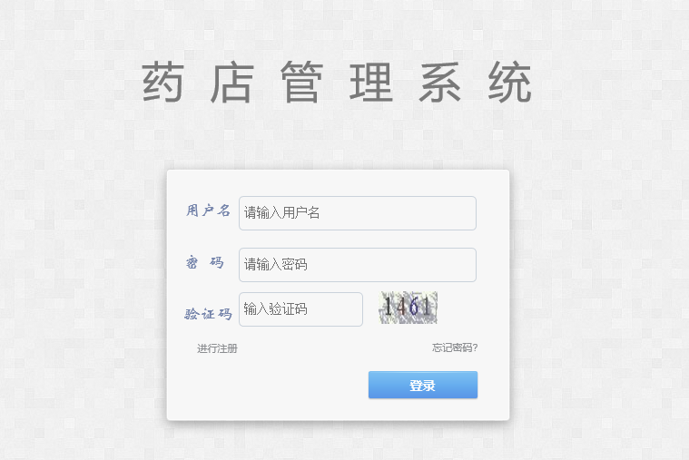
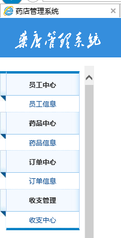
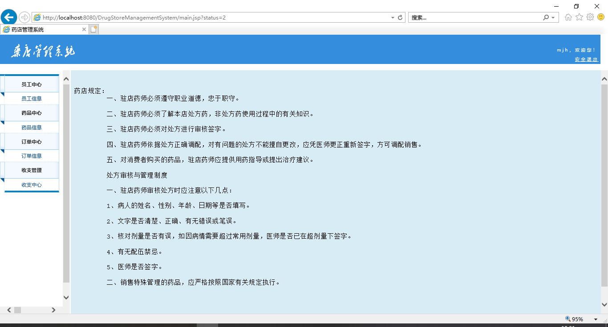
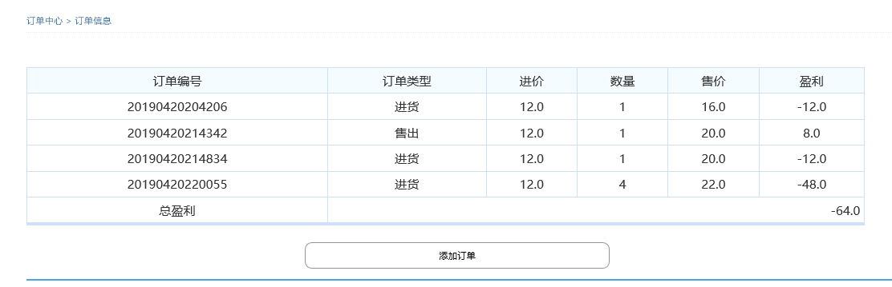
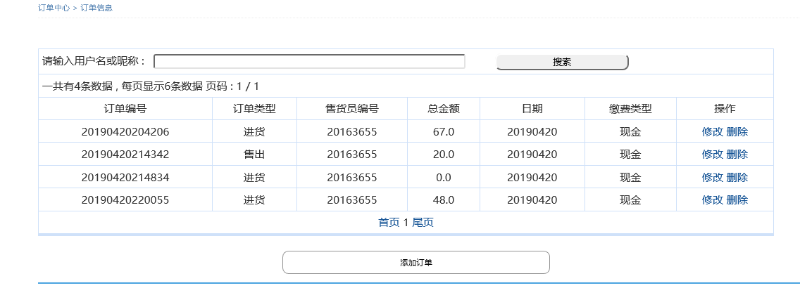

 

   
本系统基于MVC模式，使用HTML+CSS+servelet技术，使用ORACLE数据库，实现了基本信息的增删改查以及页面可视化展示。

   
本系统在订单管理功能上是一个进销存模式，可适用于二次开发。

   <h3>登录页面：</h3>
  
    <h3>功能栏：</h3>
  
    <h3>首页：</h3>
  
    <h3>盈利中心：</h3>
  
  <h3>订单中心：</h3>
  
   

